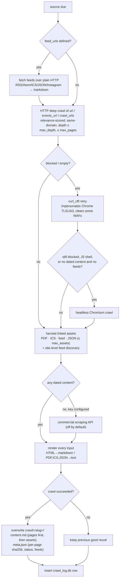
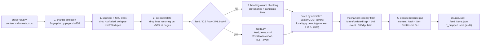
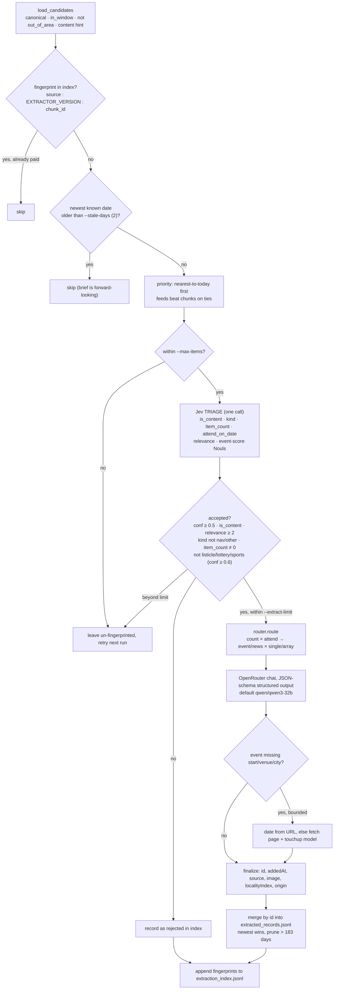
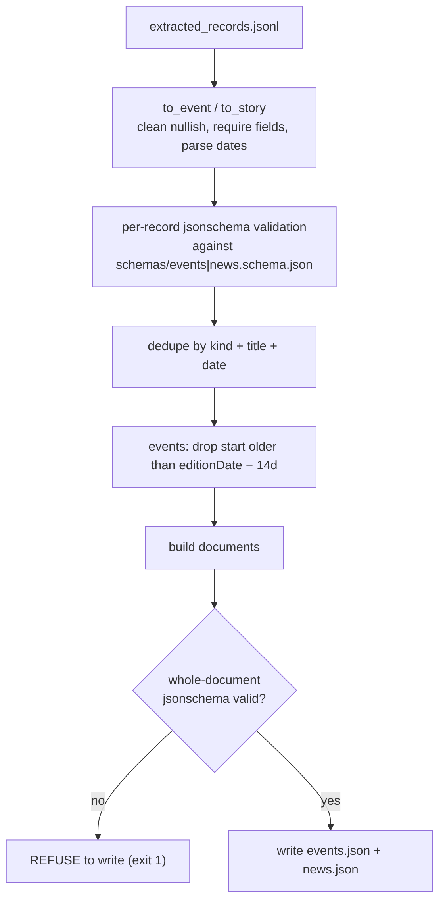
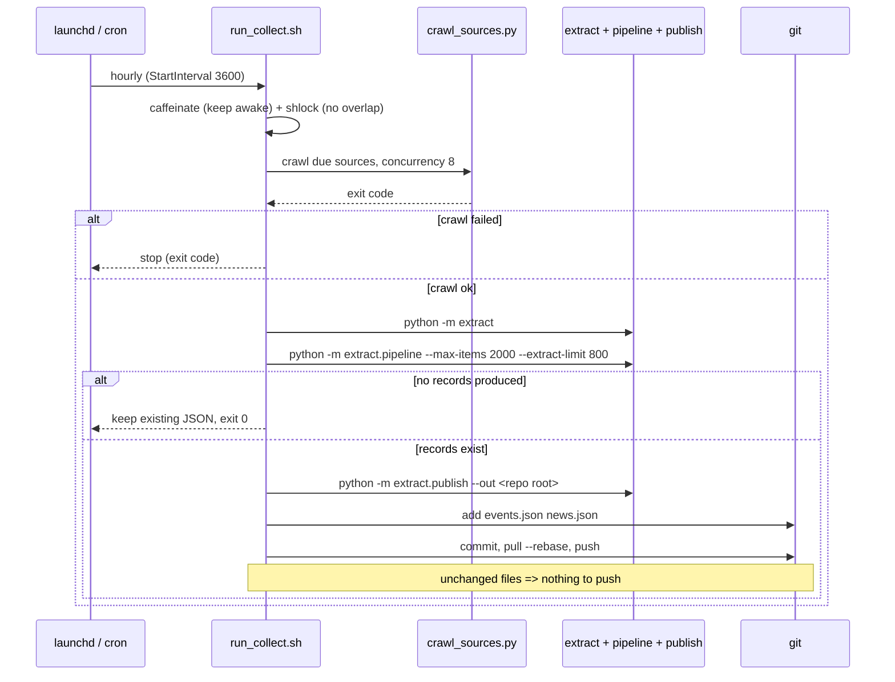
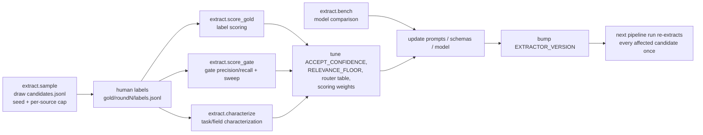

# Daily Brief data flow

How `source.json` becomes the `events.json` / `news.json` that the brief renders.
Covers the crawl → chunk → review → rework → publish path, the artifacts at each
hand-off, and where cost is controlled.

The pipeline is a chain of four stages, run by `run_collect.sh`:

```
crawl_sources.py        extract (funnel)        extract.pipeline        extract.publish
  source.json    ──▶  crawl/<slug>/...   ──▶  processed/<slug>/...  ──▶  processed/*.jsonl  ──▶  events.json
  crawl_log.db                              (chunks/feed_items)        (records)                 news.json
```

> Stage numbers come from [`EXTRACTION.md`](EXTRACTION.md). Note that the
> funnel's own docstring calls the recency filter "stage 4"; in the design doc
> stage 4 is the Jev candidate gate. Both are used below with that caveat.

---

## 1. End-to-end flow

```mermaid
flowchart TD
    SRC["source.json<br/>source catalog: url, feeds, frequency, engine"]
    SCHED["launchd / cron<br/>run_collect.sh (hourly)"]

    subgraph CRAWL["1. crawl_sources.py — collector"]
        DUE["select due sources<br/>last success + frequency"]
        LADDER["cheapest-first fetch ladder<br/>feeds → HTTP → curl_cffi → browser → API"]
        RESULT["crawl/&lt;slug&gt;/<br/>content.md + meta.json"]
        LOG[("crawl_log.db<br/>one row per attempt")]
    end

    subgraph FUNNEL["2. extract — mechanical funnel"]
        F0123["stage 0–3<br/>segment, de-boilerplate, chunk, parse feeds"]
        RECENCY["recency filter<br/>14d event / 183d publish"]
        DEDUPE["stage 5 dedupe<br/>is_canonical"]
        PROC["processed/&lt;slug&gt;/<br/>chunks.jsonl · feed_items.jsonl<br/>*_dropped.jsonl · funnel.json"]
    end

    subgraph PIPE["3. extract.pipeline — triage, route, extract"]
        INDEX[("extraction_index.jsonl<br/>fingerprint: never re-pay")]
        TRIAGE["Jev triage<br/>accept / kind / count / attend / relevance / score"]
        ROUTE["router<br/>event|news × single|array"]
        LLM["OpenRouter extraction<br/>JSON-schema structured output"]
        ENRICH["enrich events<br/>URL date / fetch + touchup"]
        FINAL["finalize<br/>ids, provenance, images"]
        STORE[("extracted_records.jsonl<br/>merged by id, pruned 183d")]
    end

    PUB["4. extract.publish<br/>validate against schemas/ — refuse to write if invalid"]
    OUT["events.json (v2.0.0)<br/>news.json (v1.1.0)"]
    GIT["5. git commit + rebase + push"]
    APP["app.js renders the brief"]

    SCHED --> SRC --> DUE --> LADDER --> RESULT --> F0123
    LADDER --> LOG
    F0123 --> RECENCY --> DEDUPE --> PROC
    PROC --> INDEX
    INDEX --> TRIAGE --> ROUTE --> LLM --> ENRICH --> FINAL --> STORE
    STORE --> PUB --> OUT --> GIT --> APP
    INDEX -. "skip already-processed candidates" .-> TRIAGE
```



---

## 2. Collection (`crawl_sources.py`)

**Input:** `source.json`. **Log:** `crawl_log.db`. **Output:** latest good
`crawl/<slug>/{content.md,meta.json}`.

### 2.1 Scheduling

A source is due when `now >= last_successful_run + frequency` (`hourly`,
`4hours`, `daily`, `weekly`, `monthly`). Scheduling keys off **success**, so a
failure does not hammer the source every hour; once overdue it is retried until
it succeeds. `--force` ignores the schedule.

### 2.2 Cheapest-first fetch ladder



Key properties:

- **All tiers produce the same shape.** Only the fetch mechanism changes; every
  document is rendered through crawl4ai's HTML→markdown pipeline, so
  `content.md` / `meta.json` are uniform.
- **Feeds are first-class.** They are cheap, structured, dated, and can suppress
  browser escalation. `meta.crawl.feeds` carries a structural summary for the
  funnel.
- **Latest-good-only.** A failed run never overwrites the previous good files.
- `content.md` wraps each block in `<!-- page N -->` / `<!-- asset N -->` with
  its URL and status; `meta.json` carries per-page `sha256`, `status_code`,
  `success`, `depth`, images, and the feed summaries.

---

## 3. Mechanical funnel (`python3 -m extract`)

**Input:** `crawl/` (read-only). **Output:** `processed/<slug>/`. Never writes
into `crawl/`.



Artifacts:

| File | Contents |
| --- | --- |
| `chunks.jsonl` | stage-3 chunks: text, provenance (`source_slug`, `url`, `page_sha256`, `heading`, offsets), `signals`, `candidate_hint`, `is_canonical`, `in_window` |
| `chunks_dropped.jsonl` | recency-filtered-out chunks with `filter_reason` (audit) |
| `feed_items.jsonl` | structured RSS/Atom/ICS items (`title`, `url`, `publishedAt`/`start`, `summary`, `media`, `author`, images) |
| `feed_items_dropped.jsonl` | filtered feed items (audit) |
| `funnel.json` | per-source stats + input fingerprint |
| `pages.jsonl` | cleaned page text (only with `--emit-pages`) |

Cross-source `processed/dedupe.json` records duplicate totals. `.state.json`
holds per-source fingerprints for `--changed-only`.

Highlights:

- **Change detection** is the biggest cost lever: unchanged `sha256` pages and
  assets are skipped before any work.
- **De-boilerplate** removes ~43% of text on the measured corpus before any
  model sees it.
- **Feeds bypass chunking** — they already carry most of a news/event record.
  Raw `<item>`/`<entry>` XML that arrived as a page is recovered by a fallback
  parser.
- **Locality** is inferred per item (not per source), which catches aggregator
  feeds returning out-of-area events. `--drop-out-of-area` is opt-in.
- **Dedupe** (stage 5) marks `dup_group` / `is_canonical` / `duplicate_of`;
  downstream stages skip non-canonical records. It is mechanical today; a Jev
  "same item?" tiebreak is a possible later refinement.

---

## 4. Incremental extraction (`python3 -m extract.pipeline`)

**Input:** `processed/<slug>/{chunks,feed_items}.jsonl`.
**Output:** cumulative `processed/extracted_records.jsonl` plus the fingerprint
index `processed/extraction_index.jsonl`.



Design rules:

- **Code decides structure, Jev decides fuzzy routing, the LLM only generates.**
  The router is a pure table, and ids / `addedAt` / `localityIndex` are assigned
  by code — never invented by a model.
- **Idempotent by fingerprint.** A candidate is re-paid for only when its
  content changes or `EXTRACTOR_VERSION` is bumped. This is what makes an hourly
  run cheap: steady-state cost is only newly-crawled candidates.
- **Event scoring rides along in the triage call** (nine positive / four
  negative Nouls → `extract/scoring.py`, 0–100, neutral = 50).
- **Content-class drops ride along too**: `is_listicle`, `is_lottery`, and
  `is_sports` are confident-only drops (conf ≥ 0.60) applied before routing, so
  listicles, lotto results, and sports coverage never reach generation.
- **Enrichment is bounded** (`--enrich-limit`, default 200) and best-effort;
  failures leave the record for publish to drop.
- Accepted candidates beyond `--extract-limit` are left un-fingerprinted on
  purpose so they are retried, not silently lost.

---

## 5. Publish (`python3 -m extract.publish`)

**Input:** `processed/extracted_records.jsonl`.
**Output:** repo-root `events.json` (v2.0.0) and `news.json` (v1.1.0).



- Events publish only when all of `id, title, url, start, venue, city, category,
  summary` are present; stories need `id, title, summary, url, publishedAt,
  addedAt, source, localityIndex`.
- Images are joined from the crawler/feed data (`imageUrl`/`imageAlt` for events,
  `photo` for stories).
- Validation happens twice (per record and per document), so a malformed run can
  never publish a broken file.

---

## 6. Orchestration (`run_collect.sh`)



- Reference implementation: a `launchd` agent
  (`com.dailybrief.collect`, `StartInterval` 3600), because cron does not fire
  while the Mac is asleep and launchd coalesces missed runs on wake.
  `caffeinate` only prevents sleep *during* a run; `shlock` serializes runs.
- Everything is appended to `cron.log`.
- `COLLECT_NO_PUSH=1` skips step 5 (safe local verification).

---

## 7. Offline review and rework loop

Tuning happens against hand-labeled gold samples, never against production
records. The loop is: sample candidates, label them, score the gate/router/
model, then change code or prompts and re-extract.



- Gold data lives in `gold/` and is **local only** (git-ignored); the sampler
  records its seed and corpus fingerprint so rounds stay comparable.
- `EXTRACTOR_VERSION` is the rework trigger: bumping it invalidates every
  fingerprint, so the next run re-triages/re-extracts once with the new logic,
  then settles back to incremental.
- Gold rounds 1–2 and the gate/characterization/model reports are the inputs to
  the thresholds currently in `extract/jev.py` and `extract/router.py`.

---

## 8. Artifact / contract summary

| Artifact | Written by | Read by | Notes |
| --- | --- | --- | --- |
| `source.json` | humans | crawler | source catalog |
| `crawl_log.db` | crawler | crawler CLI | attempt log, scheduling source |
| `crawl/<slug>/content.md` | crawler | funnel | latest good only; page/asset markers |
| `crawl/<slug>/meta.json` | crawler | funnel | per-page sha256/status/images + feeds |
| `processed/<slug>/chunks.jsonl` | funnel | pipeline | model-free candidate input |
| `processed/<slug>/feed_items.jsonl` | funnel | pipeline | structured feed records |
| `processed/<slug>/*_dropped.jsonl` | funnel | humans | recency-filter audit |
| `processed/extraction_index.jsonl` | pipeline | pipeline | fingerprints, never re-pay |
| `processed/extracted_records.jsonl` | pipeline | publish | cumulative store, merged by id |
| `events.json` / `news.json` | publish | `app.js` | schema-validated brief inputs |

**Read/write guard:** `crawl/` is immutable to the funnel; `extract` refuses to
run if `--out` resolves inside `crawl/`.

---

## 9. Cost controls (in order of impact)

1. **Change detection** — unchanged pages/assets are never reprocessed.
2. **Mechanical funnel** — de-boilerplate removes ~43% of text before any model.
3. **Fingerprinted extraction index** — no candidate is paid for twice.
4. **Jev triage** — one cheap typed decision (with routing + scoring in the same
   call) gates expensive generation; ~5–10% of the corpus reaches the LLM.
5. **Staleness + date-first selection** — candidates dated > 2 days past are
   skipped; the rest are triaged nearest-to-today first.
6. **Per-run caps** — `--max-items` (Jev calls) and `--extract-limit`
   (generation calls); deferred candidates are retried next run.

Relevant environment knobs in `run_collect.sh`: `COLLECT_MAX_ITEMS` (2000),
`COLLECT_EXTRACT_LIMIT` (800), `COLLECT_CONCURRENCY` (8), `COLLECT_OUT_DIR`,
`COLLECT_NO_PUSH`; extraction model `OPENROUTER_EXTRACT_MODEL`
(default `qwen/qwen3-32b`).

See [`README.md`](README.md) for CLI usage, [`EXTRACTION.md`](EXTRACTION.md) for
the stage design, and [`FUNNEL-RECOMMENDATIONS.md`](FUNNEL-RECOMMENDATIONS.md)
for the funnel backlog.